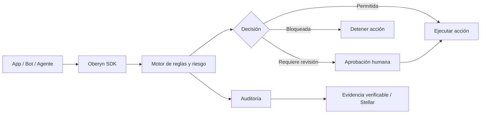

# 🛡️ Oberyn

> **Control, reglas, aprobaciones humanas y auditoría verificable para agentes de IA que ya no solo responden: ahora operan.**


Oberyn es una capa de confianza para aplicaciones con IA. Permite que agentes, bots y flujos automatizados llamen APIs, ejecuten herramientas, propongan pagos y trabajen dentro de sistemas reales sin perder control sobre **qué hacen, por qué lo hacen, quién lo aprobó y cómo se demuestra después**.

---

## ✨ Qué problema resuelve

Los agentes de IA ya pueden:

- consultar datos privados;
- llamar APIs externas;
- modificar registros;
- ejecutar procesos internos;
- iniciar solicitudes de pago;
- interactuar con herramientas críticas.

El riesgo aparece cuando la IA pasa de hablar a actuar.

**Una respuesta incorrecta se corrige. Una acción crítica mal ejecutada puede tener consecuencias reales.**

Oberyn intercepta esas acciones antes de que ocurran, evalúa reglas y riesgo, solicita aprobación humana cuando corresponde y registra evidencia auditable.

---

## 🧠 Cómo funciona



La regla base:

```txt
Si la IA puede ejecutar algo importante,
Oberyn debe poder revisarlo, limitarlo y registrarlo.
```

---

## 🚀 Módulos principales

| Módulo | Qué hace |
| --- | --- |
| **SDK** | Protege prompts, tool calls, llamadas HTTP, procesos internos y eventos de agentes desde el código del cliente. |
| **Reglas** | Define qué puede hacer la IA, qué se bloquea y qué requiere aprobación humana. |
| **Aprobaciones** | Centraliza solicitudes sensibles para que una persona apruebe, rechace o bloquee. |
| **Auditoría** | Registra eventos, decisiones, riesgo, acciones, servicios y evidencia. |
| **Evidencia Stellar** | Ancla hashes de eventos para demostrar integridad sin exponer datos sensibles. |
| **PayGuard** | Permite que agentes propongan pagos, pero solo una aprobación verificada puede mover fondos. |
| **Integraciones** | Detecta o registra servicios usados por el proyecto. |
| **Flujos** | Agrupa procesos protegidos por acción, servicio o agente. |

---

## 💸 PayGuard

PayGuard es la extensión de Oberyn para pagos iniciados por IA.

La idea es simple:

```txt
El agente propone.
La persona aprueba.
Oberyn ejecuta con control verificable.
```

PayGuard valida:

- agente autorizado;
- destinatario verificado;
- monto permitido;
- token configurado;
- riesgo de la operación;
- aprobación humana;
- registro de auditoría.

Cuando está conectado en modo real, Oberyn puede usar **Trustless Work** para crear, fondear y liberar un escrow después de pasar las reglas y aprobación.

---

## 🔐 Evidencia con Stellar

Oberyn no guarda prompts sensibles ni datos privados en blockchain.

Lo que se ancla es evidencia criptográfica:

- hash del evento;
- hash raíz / prueba de integridad;
- timestamp;
- referencia de transacción;
- estado de verificación.

Esto permite demostrar que un evento de auditoría no fue alterado después de generarse.

---

## 🏗️ Arquitectura

```txt
.
├── backend/              API Express, Clerk, Supabase, SDK ingestion, PayGuard, Stellar
├── frontend/             Dashboard React + Vite
├── src/                  Código fuente del SDK `oberyn`
├── dist/                 Build del SDK
├── database/             Schema y migraciones Supabase/Postgres
├── docs/                 Documentación técnica renderizada por la app
├── examples/             Demos SDK, Gateway y PayGuard
├── packages/             Paquetes auxiliares
└── scripts/              Helpers de desarrollo local
```

---

## ⚙️ Stack

- **Frontend:** React 19, Vite, Tailwind CSS, React Router, Clerk.
- **Backend:** Node.js, Express, TypeScript, Zod.
- **Base de datos:** Supabase / Postgres.
- **Auth:** Clerk.
- **SDK:** paquete local `oberyn`.
- **Auditoría verificable:** Stellar.
- **Pagos controlados:** PayGuard + Trustless Work.

---

## 🧪 Quickstart local

### 1. Instalar dependencias

```bash
npm --prefix backend install
npm --prefix frontend install
```

Si vas a probar el mini proyecto del SDK:

```bash
npm --prefix examples/sdk-mini-api install
```

### 2. Configurar backend

Crea `backend/.env`:

```env
PORT=4000

SUPABASE_URL=https://your-project.supabase.co
SUPABASE_ANON_KEY=your_supabase_anon_key
SUPABASE_SERVICE_ROLE_KEY=your_supabase_service_role_key

CLERK_SECRET_KEY=your_clerk_secret_key
CLERK_PUBLISHABLE_KEY=your_clerk_publishable_key

OBERYN_SDK_FALLBACK_SECRET=change-me

STELLAR_NETWORK=testnet
STELLAR_HORIZON_URL=https://horizon-testnet.stellar.org
STELLAR_SOURCE_PUBLIC_KEY=your_stellar_public_key
STELLAR_SOURCE_SECRET_KEY=your_stellar_secret_key
STELLAR_EXPLORER_BASE_URL=https://stellar.expert/explorer/testnet/tx

TRUSTLESS_WORK_MODE=mock
TRUSTLESS_WORK_API_KEY=
TRUSTLESS_WORK_BASE_URL=https://dev.api.trustlesswork.com
TRUSTLESS_WORK_NETWORK=testnet
TRUSTLESS_WORK_SIGNER_PUBLIC_KEY=
TRUSTLESS_WORK_SIGNER_SECRET_KEY=
TRUSTLESS_WORK_APPROVER_PUBLIC_KEY=
TRUSTLESS_WORK_PLATFORM_ADDRESS=
TRUSTLESS_WORK_RELEASE_SIGNER_PUBLIC_KEY=
TRUSTLESS_WORK_DISPUTE_RESOLVER_PUBLIC_KEY=
TRUSTLESS_WORK_USDC_ISSUER=
TRUSTLESS_WORK_PLATFORM_FEE=0
```

> Nunca pongas `SUPABASE_SERVICE_ROLE_KEY`, `CLERK_SECRET_KEY`, claves privadas Stellar o tokens de Trustless Work en el frontend.

### 3. Configurar frontend

Crea `frontend/.env`:

```env
VITE_CLERK_PUBLISHABLE_KEY=your_clerk_publishable_key
VITE_API_BASE_URL=http://localhost:4000/api
```

### 4. Crear tablas en Supabase

Ejecuta el schema y migraciones en orden:

```txt
database/schema.sql
database/migrations/001_extend_organizations.sql
database/migrations/002_sdk_ingestion.sql
database/migrations/003_gateway_configs.sql
database/migrations/004_runtime_controls.sql
database/migrations/005_stellar_evidence.sql
database/migrations/006_payguard.sql
```

### 5. Levantar todo

Desde la raíz:

```bash
npm run dev
```

URLs locales:

```txt
Frontend: http://localhost:5173
Backend:  http://localhost:4000
Docs:     http://localhost:5173/docs/sdk
```

---

## 📦 SDK

Instalación en un proyecto:

```bash
npm install oberyn
```

Inicialización:

```ts
import { createOberyn } from "oberyn";

const oberyn = createOberyn({
  apiKey: process.env.OBERYN_SDK_KEY!,
  endpoint: process.env.OBERYN_SDK_ENDPOINT!,
  environment: "production",
  approvalMode: "poll"
});
```

Proteger una acción crítica:

```ts
const result = await oberyn.proof.guard(
  {
    name: "billing.refund.create",
    category: "payments",
    target: "stripe",
    arguments: { paymentIntentId, amount },
    actor: { id: user.id, role: user.role }
  },
  () => stripe.refunds.create({ payment_intent: paymentIntentId, amount })
);
```

Proteger una llamada HTTP:

```ts
const response = await oberyn.api.request(
  "https://api.deepseek.com/chat/completions",
  {
    method: "POST",
    headers: {
      authorization: `Bearer ${process.env.DEEPSEEK_API_KEY}`,
      "content-type": "application/json"
    },
    body: JSON.stringify({
      model: "deepseek-chat",
      messages: [{ role: "user", content: "Resume este ticket." }]
    })
  },
  {
    actionName: "deepseek.chat.completions.create"
  }
);
```

Documentación: [`docs/sdk.md`](docs/sdk.md)

---

## 🧾 PayGuard local

El ejemplo vive en:

```txt
examples/sdk-mini-api
```

Configura `examples/sdk-mini-api/.env`:

```env
OBERYN_SDK_KEY=ob_pk_your_project_key
OBERYN_SDK_ENDPOINT=http://localhost:4000/api/sdk/events
OBERYN_SERVICE_NAME=payguard-demo

OBERYN_PAYGUARD_AGENT_ID=
OBERYN_PAYGUARD_RECIPIENT_WALLET=
OBERYN_PAYGUARD_AMOUNT=
OBERYN_PAYGUARD_REASON=

OBERYN_PAYGUARD_RECIPIENT_NAME=
OBERYN_PAYGUARD_TOKEN=USDC
OBERYN_PAYGUARD_RISK_LEVEL=low
```

Comandos:

```bash
cd examples/sdk-mini-api
npm run payguard:setup
npm run payguard:config
npm run payguard:test
```

`payguard:test` crea una solicitud real en el proyecto. La aprobación, ejecución y auditoría se revisan desde el dashboard.

---

## 🧭 Documentación interna

| Documento | Ruta |
| --- | --- |
| SDK | [`docs/sdk.md`](docs/sdk.md) |
| PayGuard | [`docs/payguard.md`](docs/payguard.md) |
| Gateway | [`docs/gateway.md`](docs/gateway.md) |

En la app:

```txt
/docs/sdk
/docs/gateway
```

---

## ✅ Comandos útiles

```bash
# Frontend
npm --prefix frontend run dev
npm --prefix frontend run typecheck
npm --prefix frontend run build

# Backend
npm --prefix backend run dev
npm --prefix backend run typecheck
npm --prefix backend run test
npm --prefix backend run test:payments

# Todo local
npm run dev
```

---

## 🧱 Estado del producto

| Área | Estado |
| --- | --- |
| Landing pública | Funcional |
| Auth con Clerk | Funcional |
| Organizaciones y proyectos | Funcional |
| SDK runtime | Funcional |
| Reglas y aprobaciones | Funcional |
| Auditoría | Funcional |
| Evidencia Stellar | Funcional en testnet/configuración local |
| PayGuard | Funcional con modo mock/live según variables |
| Gateway | Runtime técnico avanzado, interfaz pública en desarrollo |
| Bots | Próximamente |

---

## 🛡️ Seguridad

- No enviar API keys de proveedores dentro de `metadata`, `payload` o prompts.
- Mantener claves privadas solo en backend.
- Usar `OBERYN_SDK_KEY` para identificar el proyecto, no como secreto de proveedor.
- Revisar eventos de auditoría antes de activar flujos críticos en producción.
- Configurar wallets verificadas antes de usar PayGuard en modo live.

---

## 🌱 Roadmap

- Mejor experiencia guiada para SDK y PayGuard.
- Asistente local para herramientas como Codex, Claude Code, Cursor y terminal.
- Conectores de navegador para IA usada desde web apps.
- Más analítica de riesgo, costo y servicios por proyecto.
- Gateway público con configuración completa.
- Verificación pública de evidencia.
- Reglas más visuales y plantillas por caso de uso.

---

## 🤝 Contribuir

Las contribuciones son bienvenidas. Mantén los cambios enfocados, agrega pasos de verificación y actualiza documentación cuando cambien:

- formas de eventos del SDK;
- reglas;
- aprobaciones;
- PayGuard;
- Stellar;
- migraciones;
- rutas públicas.

---

## 📄 Licencia

Licencia pendiente de definir.

---

<p align="center">
  <strong>Oberyn gobierna acciones de IA antes de que impacten sistemas reales.</strong>
  <br />
  IA que opera, pero con límites, evidencia y control humano.
</p>
